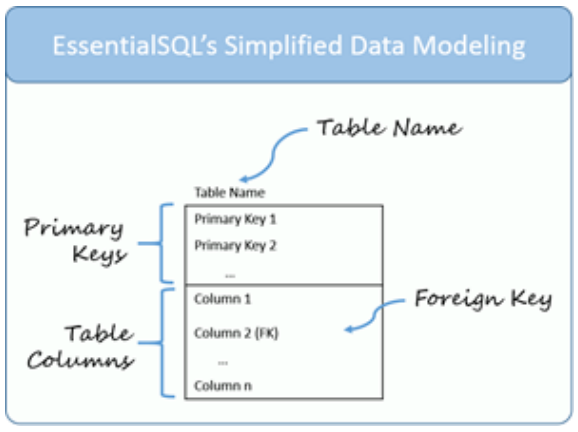
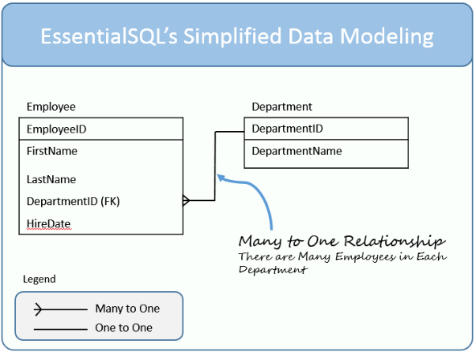

# Reading-Notes.

# Sequelize :

# NoSQL vs SQL :

| **SQL**                                              | **NoSQL**                                                                                                                    |
| ---------------------------------------------------- | ---------------------------------------------------------------------------------------------------------------------------- |
| Relational Databases                                 | Non-Relational or Distributed Database                                                                                       |
| Table based databases                                | Document based, key-value pairs, graph databases or wide-column stores                                                       |
| Predefined schema                                    | Dynamic schema                                                                                                               |
| Vertically scalable                                  | Horizontally scalable                                                                                                        |
| Uses SQL (Structured Query Language)                 | Using UnQL (Unstructured Query Language)                                                                                     |
| Good fit for the complex query intensive environment | Not good fit for complex queries                                                                                             |
| Not best fit for hierarchical data storage           | Fits better for the hierarchical data storage                                                                                |
| open-source or close-sourced from commercial vendors | storing data as graph databases,document store databases, key-value store databases, column store database and XML databases |
| ...                                                  | ...                                                                                                                          |

### SQL Examples :

- MySql.
- Oracle.
- Sqlite.
- Postgres.
- MS-SQL.

### NoSQL Examples :

- MongoDB.
- CouchDb.
- Redis.
- BigTable.
- RavenDb.
- Cassandra.
- Hbase.
- Neo4j.

# Data Modeling :

## Data Modeling – Table Elements :

- Table Name : which is located at the top of the table.
- Primary Keys : Remember the primary keys uniquely identify each row in a table. A table typically has one primary key, but can have more. When the key has more than one column, it is called a compound key.
- Table Columns : There can be one or more table columns. To keep the diagrams simple, I don’t show the data types. I may introduce those later when we focus on more comprehensive modeling.
- Foreign Key : This is a column or set of columns which match a primary key in another table.

## Data Modeling – Table Relationships :

| Cardinality         | Notation |
| ------------------- | -------- |
| zero or one-to-many | 0..\*    |
| one-to-many         | 1..\*    |
| zero or one-to-one  | 0..1     |
| one-to-one          | 1..1     |

[nosql vs sql](https://www.thegeekstuff.com/2014/01/sql-vs-nosql-db/?utm_source=tuicool)

[sql modeling techniques](https://www.essentialsql.com/get-ready-to-learn-sql-7-simplified-data-modeling/)

[sql vs nosql Videos](https://www.youtube.com/watch?v=ZS_kXvOeQ5Y&ab_channel=Academind)

[sequelize api](https://sequelize.org/docs/v6/)