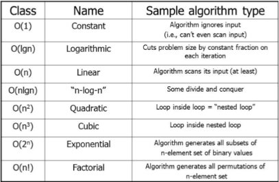

# Complexity (Big O) & Linked List :

# Complexity (Big O) :

## What is Complexity (Big O) ?

Big O : It's a notation used to describe The worst case analysis of an algorithm or function based on 2 factors:

- Running Time: How much time the function/algorithm needs?
- Memory Space: How much space the function/algorithm needs to store its data and instructions.

## How to find Big O ?

Big O’s role in algorithm efficiency is to describe the Worst Case of efficiency an algorithm can have in performing it’s job. It specifically looks at the factors mentioned above, which we often refer to as Space and Time. In order to analyze these limiting factors, we should consider 4 Key Areas for analysis:

- Input Size: The size of the parameter values that are read by the algorithm. (n) Higher More likely higher running time and memory space.

- Units of Measurement: milliseconds and number of operations for running time factor and the amount of space needed for input, output, code and working area for space factor.

- Orders of Growth.

- Best Case, Worst Case, and Average Case

## Worst Case, Best Case, Average Case :

- Big O(oh): This notation describes the Worst Case for an algorithm. The Order of Growth used represents the upper bounds of Time and Space.
    - Worst Case: The efficiency for the worst possible input of size `n`
    - Big O(oh) ===> Worst Case

- Big Omega: This notation describes the Best Case for a given algorithm. The Order of Growth used represents the lower bounds of Time and Space.
    - Best Case: The efficiency for the best possible input of size `n`
    - Big Omega ===> Best Case

- Big Theta: This notation describes the Average Case. The Order of Growth used represents the tight bound of Time and Space.
    - Average Case: The efficiency for a “typical” or “random” input of size `n`.
    - Big Theta ===> Average Case

## Basic asymptotic efficiency of code :

## Summery of Big O

- Big O: The worst case analysis of algorithm efficiency.
- Big Omega: The best case analysis of algorithm efficiency.
- Big Theta: The typical or random case used for analysis of algorithm efficiency.
- Running Time: The amount of time required for an algorithm to complete.
- Memory Space: The amount of memory resources required for an algorithm to complete.
- Input Size: Represented by the variable n, the total size of values used as parameters in an algorithm.
    

# Linked List
## What is a Linked List :

- A Linked List is a sequence of `Nodes` that are connected/linked to each other.
- The most defining feature of a Linked List is that each `Node` references the next `Node` in the link.

## Types of Linked Lists :

- Singly Linked List :

    Singly refers to the number of references the node A has. A Singly linked list means that there is only one reference, and the reference points to the Next node in a linked list.

- Doubly Linked List :

    Doubly refers to there being two (double) references within the node. A Doubly linked list means that there is a reference to both the `Next` and `Previous` node.

- Multiply Linked List:

    In a multiply linked list, each node consists of two or more link `fields`. Each field is used to join the same set of records in a different order of the same set.

- Circular Linked List:

    A circular linked list is a `variation` of a linked list in which the last element is linked to the first element. This forms a `circular loop`.

## Linked list contains || components :

- Node - Nodes are the individual items/links that live in a linked list. 
- Data - Each node contains the data for each link.
- Next - Each node contains a property called Next. This property contains the reference to the next node.
- Head - The Head is a reference of type Node to the first node in a linked list.
- Current - The Current is a reference of type Node to the node that is currently being looked at. When traversing, you create a new Current variable at the Head to guarantee you are starting from the beginning of the linked list.

 

## Advantage of Linked Lists :

- Nodes can easily be removed or added from a linked list without reorganizing the entire data structure. This is one advantage it has over arrays.

 

## Disadvantages of Linked Lists :

- Search operations are slow in linked lists. Unlike arrays, random access of data elements is not allowed. Nodes are accessed sequentially starting from the first node. It uses more memory than arrays because of the storage of the pointers.

# Important Notes of Linked Lists

## Each single node must have two element :

- `DATA`: The information that the node contains.
- `NEXT`: reference to the next node.

## The properties of the linked list data structure :

- `SIZE`: The number of elements in the linked list.
- `HEAD`: The first element in the linked list.
- `TAIL`: The last element in the linked list.

## The main operations of a linked list data structure are :

- `insertAt`: Inserts an element at the specific index.
- `removeAt`: Removes the element at the specific index.
- `getAt`: Retrieves the element at the specific index.
- `clear`: Empties the linked list.
- `reverse`: Reverses the order of elements in the linked list.